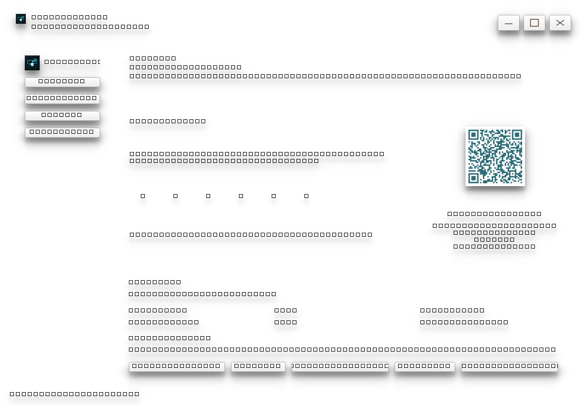

# Transfer Tool

一个面向 Windows + iPhone/iPad Safari 的局域网文件传输工具，无需云端、登录、Mac 或 Xcode。

A local-first file transfer tool that lets a Windows desktop share files with iPhone and iPad through Safari on the same Wi-Fi network.



## 适用场景

- 想在同一 Wi-Fi 下，把 Windows 里的文件快速发到 iPhone / iPad。
- 想做一个不依赖云盘、账号体系和原生 iOS App 的本地传输工具。
- 想展示一个完整的桌面端 + Web 端 + 局域网配对 + 打包分发项目。

## 我做了什么

- 设计并实现 Windows 桌面端主应用，负责启动本地服务、展示二维码、配对码、共享文件和诊断信息。
- 构建 iPhone / iPad Safari 端移动 Web 界面，支持上传、下载、进度反馈和 trusted device 恢复。
- 实现本地配对链路，包括二维码直达、6 位配对码、浏览器信任恢复和设备撤销。
- 完成共享文件、接收文件、传输历史、运行时数据存储和日志体系。
- 打磨桌面端 UI，包括自定义标题栏、统一视觉风格、应用图标和单文件 exe 打包。

## 项目亮点

- `Local-first`: 局域网直连，不走云端，不需要登录。
- `Windows host + Safari client`: Windows 负责托管，iPhone / iPad 直接用 Safari 即可。
- `QR pairing`: 扫码即可打开移动页面并自动配对。
- `Trusted device restore`: 同一浏览器后续访问可以自动恢复授权。
- `Packaged desktop app`: 已支持 PyInstaller 打包，便于直接分发给他人使用。

## 当前支持的能力

- Windows 桌面端启动本地服务并展示可访问地址。
- iPhone / iPad Safari 上传文件到 Windows。
- Windows 将文件共享给 iPhone / iPad 下载。
- 二维码配对与 6 位配对码配对。
- trusted device 恢复与手动撤销。
- 传输历史、运行日志、诊断信息查看。

## 技术栈

- `Python 3.13`
- `PySide6`
- `Flask`
- `HTML / CSS / JavaScript`
- `PyInstaller`

## 快速开始

1. 在 Windows 安装 Python 3.13 或更新版本。
2. 安装 `windows-app/requirements.txt` 中的依赖。
3. 运行 `py windows-app/main.py`。
4. 在桌面端查看本地 URL 或直接扫描二维码。
5. 在 iPhone / iPad Safari 打开页面并完成一次配对后开始传输。

## 仓库结构

```text
Transfer Tool/
  web-app/
    assets/
    index.html
  windows-app/
    main.py
    resources/
    scripts/
    transfer_tool/
    tests/
  docs/
  tools/
  README.md
```

## 文档

- [Architecture](docs/architecture.md)
- [Protocol](docs/protocol.md)
- [Setup](docs/setup.md)
- [Packaging](docs/packaging.md)
- [Troubleshooting](docs/troubleshooting.md)
- [Manual Test Checklist](docs/manual-test-checklist.md)

## 验证

- `py -m compileall windows-app web-app`
- `py -m pytest windows-app/tests`

## 后续可继续增强的方向

- expiring shared download links
- richer mobile diagnostics
- resumable uploads / downloads
- more polished project showcase assets and demo flows
